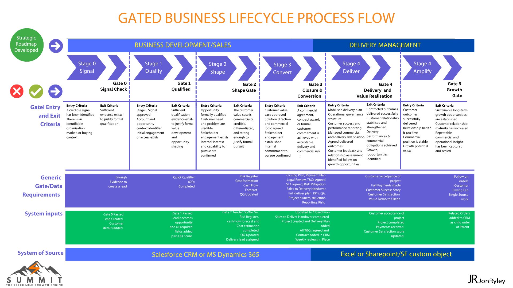
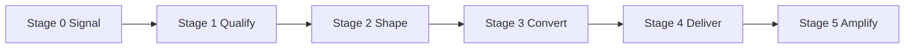

<div align="center">


<br><br>


</div>

# Summit Growth Engine
## The AI-Enabled Commercial Operating System



Summit transforms fragmented sales activity into a governed, AI-enabled commercial growth system.

Summit helps complex organisations improve qualification, governance, forecasting, delivery alignment and scalable growth through a gated commercial operating model powered by CRM, data and AI.

---

## Why Summit Matters

Modern enterprise growth is increasingly complex.

Most organisations do not have a pipeline problem.  
They have a qualification, governance, forecasting and execution problem.

Summit was designed to solve this by combining commercial governance, CRM discipline, data intelligence, AI-enabled insight, delivery alignment and operating cadence into one scalable growth system.

Summit transforms CRM from a system of record into a system of commercial insight.

---

## Why Summit Is Different

Most CRM systems manage activity.

Most sales methodologies focus only on conversion.

Most governance models operate separately from delivery.

Summit combines:

- Qualification  
- Governance  
- CRM discipline  
- Delivery alignment  
- AI-enabled intelligence  
- Commercial visibility  
- Operating cadence  
- Forecast governance  

into one integrated commercial operating system.

The result is more disciplined growth, stronger forecasting and better commercial execution.

---

## Why Now?

Commercial complexity is increasing.

Organisations are struggling with:

- Fragmented CRM adoption  
- Inconsistent qualification  
- Disconnected delivery governance  
- Unreliable forecasting  
- Rising bid costs  
- Weak operating cadence  
- Growing AI disruption  
- Poor commercial visibility  

Summit was designed for this environment.

---

## Operating Stack

**People → Process → CRM → Data → AI → Governance → Growth**

The Summit Growth Engine enables structured commercial decision making.

Each stage is defined.  
Each gate creates truth.  
Each progression is evidence-based.

This is not a collection of files.  
It is a navigable commercial system.

Summit replaces activity-driven sales with structured execution, clear decision making and measurable commercial progress.

It ensures opportunities move based on evidence, not optimism.

---

## The Summit Growth Engine

```text
Executive Governance
        ↓
Signal → Qualify → Shape → Convert → Deliver → Amplify
        ↓
People | Process | CRM | Data | AI | Governance | Cadence
        ↓
Predictable Scalable Growth
```

---

## Explore Summit

### Core Framework
- [Interactive Pipeline](https://jonryley.github.io/summit-growth-engine/)
- [Summit Overview](OVERVIEW.md)
- [Process Overview](PROCESS-OVERVIEW.md)
- [Summit Operating Model](OPERATING-MODEL.md)
- [Operating Controls](OPERATING-CONTROLS.md)

### Lifecycle
- [Stage Definitions](stages/)
- [Gate Definitions](gates/)
- [Opportunity Classification](CLASSIFICATION.md)
- [Summit Qualification Engine](SUMMIT-QQ.md)

### Commercial Governance
- [Operating Controls](OPERATING-CONTROLS.md)
- [Summit Qualification Engine](SUMMIT-QQ.md)

### Commercial Application
- [Services](SERVICES.md)
- [Benefits](Benefits.md)

### Supporting Assets
- [Templates](templates/)
- [Fields](fields/)
- [Examples](examples/)
- [Docs](docs/)
- [Images](images/)

---

## Why Summit Exists

Most organisations do not have a sales problem.

They have:

- Too many opportunities that should never progress  
- CRM systems that track activity but not decision quality  
- Weak qualification hidden behind good conversations  
- Poor alignment between sales and delivery  
- Forecasts based on hope rather than evidence  
- Inconsistent governance across opportunities  
- Limited visibility of commercial risk  
- Reactive pipeline management  
- Weak operating cadence  

**Summit fixes this.**

---

## Summit Principles

- Gates create truth  
- Truth creates growth  
- Qualification protects focus  
- Governance enables scale  
- Delivery starts before contract award  
- AI enhances judgement  
- CRM becomes a system of insight, not just a system of record  
- Growth is a system, not an event  

---

## The Lifecycle



| Stage | Purpose |
|---|---|
| Stage 0 Signal | Identify real opportunity signals early |
| Stage 1 Qualify | Decide if the opportunity is real, worth it, winnable and deliverable |
| Stage 2 Shape | Shape the commercial value, solution and delivery approach |
| Stage 3 Convert | Build the offer, manage the pursuit and convert the opportunity |
| Stage 4 Deliver | Mobilise, execute and deliver successfully |
| Stage 5 Amplify | Expand value, create advocacy and generate future growth |

---

## Opportunity Classification

Summit classifies opportunities to determine the level of governance required.

**Lite → Standard → Strategic → Complex → Transformational**

Classification drives:

- Level of governance  
- Depth of controls  
- Gate rigour  
- Review cadence  
- Executive visibility  
- Delivery involvement  
- Commercial assurance  

Full definitions:

[Opportunity Classification](CLASSIFICATION.md)

---

## Commercial Intelligence Layer

Summit is designed to turn CRM from a system of record into a system of commercial intelligence.

The intelligence layer can include:

- AI opportunity scoring  
- Forecast confidence  
- Stakeholder mapping  
- Relationship intelligence  
- Pipeline health analysis  
- Bid / no-bid insight  
- Deal velocity tracking  
- Delivery readiness  
- Commercial risk analysis  
- Margin and cashflow visibility  

AI in Summit enhances commercial insight, governance and forecasting.

AI supports judgement.  
It does not replace leadership, qualification discipline or commercial decision making.

---

## Operating Rhythm

Summit is not just a process.  
It is an operating rhythm.

The model supports:

- Weekly pipeline governance  
- Strategic pursuit reviews  
- Executive growth cadence  
- Forecast reviews  
- Delivery transition reviews  
- Red deal escalation  
- Lessons learned loops  
- AI insight reviews  

Governance only works when it has cadence.

---

## Summit Command Centre

The Summit Command Centre is the visibility layer for commercial growth.

It brings together:

- Pipeline intelligence  
- Opportunity classification  
- Gate status  
- AI insight  
- Stakeholder mapping  
- Delivery readiness  
- Financial forecasting  
- Risk visibility  
- Executive actions  
- Operating cadence  

The aim is simple:

**Better decisions. Earlier.**

---

## What Summit Does

Summit introduces a stage-driven lifecycle that ensures:

- Only the right opportunities progress  
- The right data is captured at the right time  
- Decisions are based on evidence, not optimism  
- Sales, leadership and delivery stay aligned  
- Forecasts become more reliable  
- Bid effort is focused where it matters  
- Growth is built on successful delivery, not constant new selling  

Delivery starts before the sale closes.

---

## Who Summit Supports

Summit is designed for organisations operating in complex, high-value commercial environments.

Typical stakeholders include:

- CEOs  
- CROs  
- Sales Directors  
- Revenue Operations Leaders  
- Commercial Directors  
- Bid Leaders  
- Delivery Directors  
- Transformation Leaders  
- CRM & AI Transformation Teams  

---

## Designed For

- Rail & Transportation  
- Energy & Utilities  
- Defence & Cyber  
- Infrastructure & Construction  
- Managed Services  
- Complex Enterprise Sales  
- PE-Backed Growth Organisations  
- CRM & Revenue Transformation Programmes  

---

## Summit Outcomes

Summit helps organisations create:

- Better qualification discipline  
- Faster commercial decision making  
- Improved forecast confidence  
- Reduced bid waste  
- Stronger governance  
- Better sales-to-delivery alignment  
- Higher win rates  
- Improved customer expansion  
- More predictable scalable growth  

---

## Summit in Practice

<p align="center">
  
</p>

---

## Future Direction

Summit is evolving toward:

- Predictive commercial intelligence  
- AI-assisted governance  
- Automated qualification insight  
- Enterprise growth analytics  
- Integrated delivery intelligence  
- Commercial operating orchestration  

Future roadmap areas include:

- AI qualification scoring  
- Forecast confidence modelling  
- Relationship heat mapping  
- Governance automation  
- Commercial risk analytics  
- Delivery intelligence integration  
- Salesforce integration  
- Microsoft Dynamics integration  
- Executive command centre dashboards  

---

## Created By

Created by Jon Ryley

Summit combines experience across:

- Sales transformation  
- Commercial governance  
- CRM optimisation  
- Revenue operations  
- AI-enabled commercial intelligence  
- Enterprise delivery alignment  

Built from experience across rail, energy, defence, cyber, infrastructure and regulated enterprise environments.

---

## Summit Philosophy

Growth without governance creates noise.  
Governance without intelligence creates delay.  

Summit combines both to create predictable scalable growth.

---

## License Summit

Interested in applying Summit in your organisation?

Contact:  
https://jonryley.com/contact
