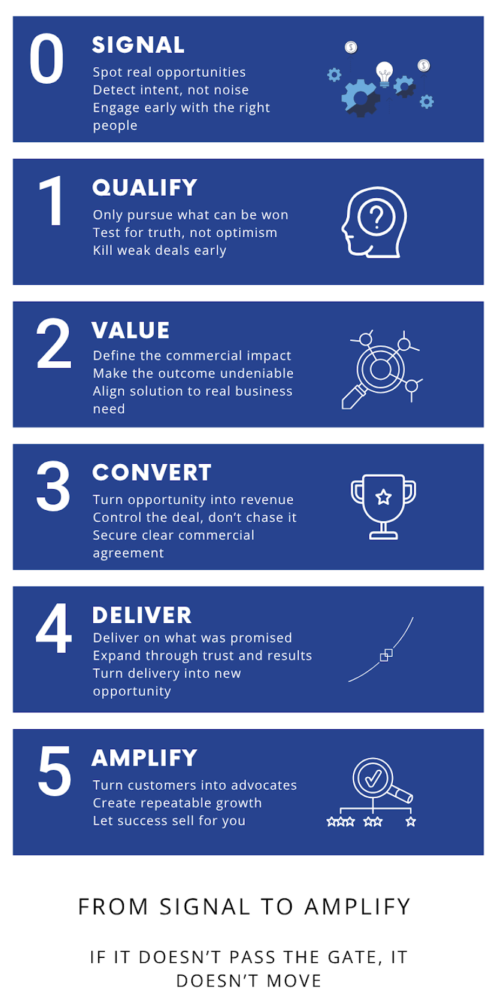

<p align="right">
  
<p align="left">
  
</p>

# Summit Growth Engine
## Powered by the Gated Business Lifecycle
### A commercial operating system for predictable scalable growth.

---

The Summit Framework drives decisions.

Each stage is defined.  
Each gate creates truth.  
Each progression is earned.

This is not a collection of files.  
It is a navigable commercial system.

Summit is a commercial operating system designed to help organisations win more business by transforming how sales, business development, CRM, and delivery work together.

It replaces activity driven sales with structured execution, clear decision making, and measurable progress.

It ensures opportunities move based on evidence, not optimism.


---

## Explore Summit

- [Interactive Pipeline](https://jonryley.github.io/summit-growth-engine/)
- [Services](SERVICES.md)
- [Operating Model](OPERATING-MODEL.md)
- [Stage Definitions](stages/)

---

## Why Summit Exists

Most organisations do not have a sales problem.  

They have:

- Too many opportunities that should never progress  
- CRM systems that track activity but not decision quality  
- Weak qualification hidden behind good conversations  
- Poor alignment between sales and delivery  
- Forecasts based on hope rather than evidence  

Summit fixes this.

---

## What Summit Does

Summit introduces a stage driven lifecycle that ensures:

- Only the right opportunities progress  
- The right data is captured at the right time  
- Decisions are based on evidence, not optimism  
- Sales, leadership, and delivery stay aligned  
- Growth is built on successful delivery, not constant new selling  

---
## Who Summit Serves

- PE backed growth businesses  
- Enterprise sales organisations  
- Regulated sector complex bids  
- CRM transformation programmes  
- Revenue operations leaders

---

## License Summit

Interested in applying Summit in your organisation?

Contact:
https://jonryley.com/contact

---

## Summit in Practice

<p align="center">
  
</p>

---

## The Lifecycle

```mermaid
flowchart LR
    A["Stage 0 Signal"] --> B["Stage 1 Qualify"] --> C["Stage 2 Value"] --> D["Stage 3 Convert"] --> E["Stage 4 Deliver"] --> F["Stage 5 Amplify"]
